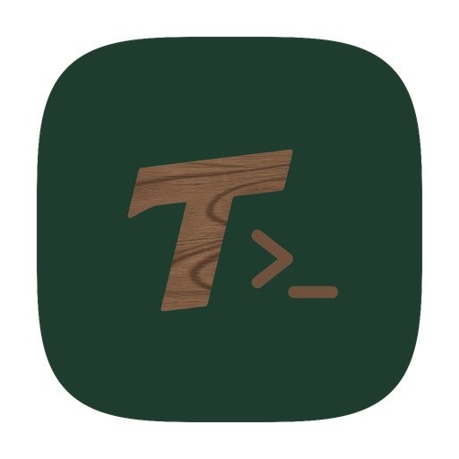

<p align="center">
  
</p>

<h1 align="center">Teak CLI</h1>

<p align="center">
  Native desktop workspace for AI CLI agents — Claude Code, Codex, Grok Build, and more.
</p>

<p align="center">
  
  
  
</p>

---

## Based on Coffee CLI

Teak CLI is an independent **fork**. The source code is based on **Coffee CLI** by [edison7009](https://github.com/edison7009). It is not affiliated with, endorsed by, or sponsored by the Coffee CLI project.

| | |
|---|---|
| Teak CLI | **https://github.com/Dloading666/teak-cli** |
| Coffee CLI source | **https://github.com/edison7009/Coffee-CLI** |
| Coffee CLI site | https://coffeecli.com |
| License (kept) | [AGPL-3.0-or-later](LICENSE) |
| Upstream brand policy (kept) | [TRADEMARKS.md](TRADEMARKS.md) |

Coffee CLI's trademark policy allows forks that rebrand and keep attribution. This tree uses a new name, icon, and bundle id, and keeps `LICENSE`, `NOTICE`, and `TRADEMARKS.md` from upstream.

---

## English

### What is Teak CLI?

A **native desktop app** (Tauri + Rust) that hosts AI command-line agents in parallel tabs: launch Claude Code, OpenAI Codex, Grok Build, OpenCode, and others, keep session history, and drive them from one window. It is a GUI workspace around those CLIs, not a CLI itself.

The binary is `teak-cli`. Config lives in `~/.teak-cli/`. If that folder does not exist and `~/.coffee-cli/` does, the first launch renames the old directory so existing sessions survive.

### Build from source

```bash
# UI
cd src-ui && npm ci && npm run build && cd ..

# App
cargo build --release
```

macOS app name after a Tauri bundle: `Teak CLI.app`. Launch a tool directly:

```bash
# macOS
open -a "Teak CLI" --args launch --tool claude --cwd /path/to/project

# Windows
teak-cli.exe launch --tool claude --cwd "C:\work\project"

# Linux
teak-cli launch --tool codex --cwd ~/work/project
```

### License

Code: **AGPL-3.0-or-later**. See [LICENSE](LICENSE) and [NOTICE](NOTICE).

Coffee CLI, Gambit, Pitch, VibeID, and related marks are claimed by the upstream project. See [TRADEMARKS.md](TRADEMARKS.md). This product is named **Teak CLI**.

---

## 简体中文

### Teak CLI 是什么？

基于 [Coffee CLI](https://github.com/edison7009/Coffee-CLI) 二次开发的 **AI CLI 桌面工作台**（Tauri + Rust）。多 Tab 跑 Claude Code、Codex、Grok Build、OpenCode 等命令行 Agent。它是桌面应用，不是命令行工具。

上游开源仓库（必须保留的出处）：

- 本仓库：https://github.com/Dloading666/teak-cli
- **https://github.com/edison7009/Coffee-CLI**
- 官网：https://coffeecli.com

本仓库已换名、换图标、换 bundle id。`LICENSE` / `NOTICE` / `TRADEMARKS.md` 按上游要求保留。本 fork **与 Coffee CLI 项目无官方关系**。

配置目录：`~/.teak-cli/`。若尚不存在且本机还有 `~/.coffee-cli/`，首次启动会把旧目录改名为新目录。

---

Based on Coffee CLI by edison7009 — https://github.com/edison7009/Coffee-CLI — https://coffeecli.com
